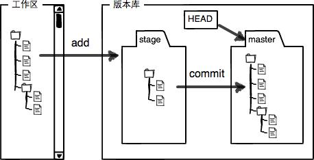

# Git 基础知识

查看当前的git 状态：

git status

查看文件做过什么修改：

git differ

退出当前文件查看 :q

添加文件

git add readme.md

保存到本地仓库

git commit -m

往Git版本库里添加的时候，是分两步执行的：

第一步是用`git add`把文件添加进去，实际上就是把文件修改添加到暂存区；

第二步是用`git commit`提交更改，实际上就是把暂存区的所有内容提交到当前分支；

创建Git版本库时，Git自动为我们创建了唯一一个master分支，所以，现在，git commit就是往master分支上提交更改。

需要提交的文件修改通通放到暂存区，然后，一次性提交暂存区的所有修改。

一旦提交后，如果你又没有对工作区做任何修改，那么工作区就是“干净”的：

    $ git status
    On branch master
    nothing to commit, working tree clean

  

后续的修改同样需要add:

第一次修改 -> git add -> 第二次修改 -> git add -> git commit

Git管理的是修改，当你用git add命令后，在工作区的第一次修改被放入暂存区，准备提交，但是，在工作区的第二次修改并没有放入暂存区，所以，git commit只负责把暂存区的修改提交了，也就是第一次的修改被提交了，第二次的修改不会被提交。

查看历史的修改记录

git log

后面加上--pretty=oneline可以美化log格式

git checkout -- file可以丢弃工作区的修改

如果已经add, 用命令git reset HEAD <file>可以把暂存区的修改撤销掉（unstage），重新放回工作区

    $ git reset HEAD readme.txt
    Unstaged changes after reset:
    M	readme.txt

然后再用git checkout  --file来撤销工作区的改动

如果本地删除了已经提交过的文件,

如果确实要从版本库中删除该文件，那就用命令git rm删掉，并且git commit。

    $ git rm test.txt
    rm 'test.txt'
    
    $ git commit -m "remove test.txt"
    [master d46f35e] remove test.txt
     1 file changed, 1 deletion(-)
     delete mode 100644 test.txt

如果是删错了，需要恢复：

    $ git checkout -- test.txt

**checkout操作的本质是用暂存区文件替换工作区文件，所以无论是恢复修改还是恢复误删的文件，都可以用这个命令**

