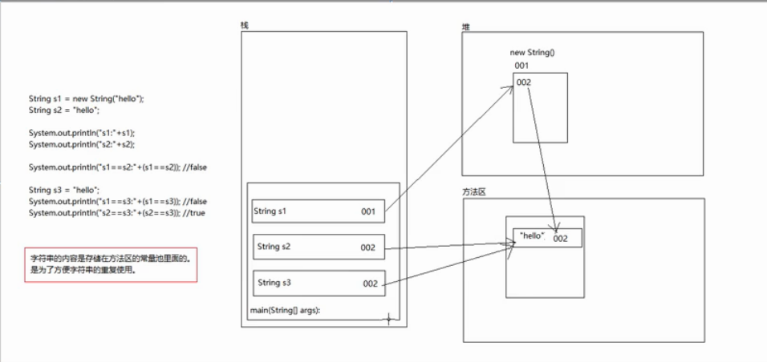

# Java基础

(参考Core Java和Java in a Nutshell)

---

### Java常识

#### 什么是JVM？
JVM 是一个程序,提供了运行 Java 程序所需的运行时环境。如果某个硬件和操作系统平
台没有相应的 JVM,就不能运行 Java 程序。
Java 程序一般都在命令行中启动,例如:
```
java <arguments> <program name>
```
这个命令会在操作系统的一个进程中启动 JVM,提供 Java 运行时环境,然后在刚启动的
(空)虚拟机中运行指定的程序。

有一点很重要,你要知道:提供给 JVM 运行的程序不是 Java 语言源码,源码必须转换
(或编译)成一种称为 Java 字节码的格式。提供给 JVM 的 Java 字节码必须是类文件格式,
其扩展名为 .class。

JVM 是字节码格式程序的解释器,一次只执行字节码中的一个指令。而且,你还要知道,
JVM 和用户提供的程序都能派生额外的线程,所以用户提供的程序中可能同时运行着多个
不同的函数。

特性：
* 包含一个容器,让应用代码在其中运行;
* 较之 C/C++,提供了一个安全的执行环境;
* 代开发者管理内存;
* 提供一个跨平台的执行环境。

---

#### 什么是字节码？
字节码和运行于硬件处理器中的机器码不太一样。计算机科学家视字节码为一种“中间表现形式”,处在源码和机器码之间。
字节码的目的是,提供一种能让 JVM 解释器高效执行的格式。

---

#### javac是编译器吗？
编译器一般生成机器码,而 javac 生成的是和机器码不太一样的字节码。javac 非常像编译器的“前半部分”,它生成的中间表现形式
可以进一步处理,生成机器码。不过,因为类文件的生成是构建过程中单独的一步,类似于 C/C++ 中的编译,所以很多开
发者都把运行 javac 的操作称为编译。

---

#### Java是解释型语言吗？
JVM 基本上算是解释器(通过 JIT 编译大幅提升性能)。可是,大多数解释性语言(例如
PHP、Perl、Ruby 和 Python)都直接从源码解释程序(一般会从输入的源码文件中构建一
个抽象句法树)。而 JVM 解释器需要的是类文件,因此当然需要多一步操作,即使用 javac
编译源码。

---

##### 总结：Java是一门弱类型，静态的，解释型语言，经过javac编译的字节码可以跨平台解释运行在JVM上。

---
---

### 运行机制

#### Java是如何处理异常的？

Java 解释器执行 throw 语句时,会立即停止常规的程序执行,开始寻找能捕获或处理异常
的异常处理程序。异常处理程序使用 try/catch/finally 语句编写。Java
解释器先在当前代码块中查找异常处理程序,如果有,解释器会退出这个代码块,开始执
行异常处理代码。异常处理程序执行完毕后,解释器会继续执行处理程序后的语句。

如果当前代码块中没有适当的异常处理程序,解释器会在外层代码块中寻找,直到找到为
止。如果方法中没有能处理 throw 语句抛出的异常的异常处理程序,解释器会停止运行当
前方法,返回调用这个方法的地方,开始在调用方法的代码块中寻找异常处理程序。Java
通过这种方式,通过方法的词法结构不断向上冒泡,顺着解释器的调用栈一直向上寻
找。如果一直没有捕获异常,就会冒泡到程序的 main() 方法。如果在 main() 方法中也没
有处理异常,Java 解释器会打印一个错误消息,还会打印一个堆栈跟踪,指明这个异常在
哪里发生,然后退出。

---

#### Java中如何区分已检异常和未检异常？

想区分已检异常和未检异常,记住两点:异常是 Throwable 对象,而且异常主要分为
两类, 通过 Error 和 Exception 子类标识。只要异常对象是 Error 类,就是未检异常。
Exception 类还有一个子类 RuntimeException ,这个类的所有子类都属于未检
异常。除此之外,都是已检异常。

---

#### Java中的变长参数列表如何实现？

变长参数列表的声明方式为,在方法最后一个参数的类型后面加上省略号( ... ),指明最
后一个参数可以重复零次或多次。

参数列表中只能有一个省略号,而且只能出现在最后一个参数中。

例如：
```java
    public static int max(int first, int... rest) {
        int max = first;
        for(int i : rest) { // 合法,因为rest其实就是数组
            if (i > max) max = i;
        }
        return max;
}
```
上面的 max() 方法和下面这个没有区别:
```java
    public static int max(int first, int[] rest) {
        /* 暂时省略主体 */
}
```
---

#### Java中数组的拷贝机制是怎样的？
参考https://blog.csdn.net/qq_36883748/article/details/79950993

1. 循环拷贝

其实没什么好说的啦，就是用一个for循环进行元素的逐个拷贝，是浅拷贝，拷贝速度比较慢； 

2. System.arraycopy（浅拷贝）

这个是系统提供的拷贝方式，它是浅拷贝，也就是说对于非基本类型而言，它拷贝的是对象的引用，而不是去新建一个新的对象。通过它的代码我们可以看到，这个方法不是用java语言写的，而是底层用c或者c++实现的，因而速度会比较快。

arraycopy() 方法的作用简单明了,但使用起来有些难度,因为要记住五个参数。第一个
参数是想从中复制元素的源数组;第二个参数是源数组中起始元素的索引;第三个参数是
目标数组;第四个参数是目标索引;第五个参数是要复制的元素数量。就算重叠复制同一个数组, arraycopy() 方法也能正确运行（将数组自身整体做移动）。

3. Arrays.copyOf（浅拷贝）

实际上它调用的就是System.arraycopy，所以肯定也是浅拷贝。

4. Object.clone

clone()比较特殊，对于对象而言，它是深拷贝，但是对于数组而言，它是浅拷贝。 
对于数组而言，它不是简单的将引用赋值为另外一个数组引用，而是创建一个新的数组。但是我们知道，对于数组本身而言，它的元素是对象的时候，本来数组每个元素中保存的就是对象的引用，所以，拷贝过来的数组自然而言也是对象的引用，所以对于数组对象元素而言，它又是浅拷贝。

---

#### Java中堆和栈的区别？

参考https://blog.csdn.net/mulinsen77/article/details/86557241

首先要明确Java中基本类型和引用类型的区别。

8种基本数据类型：
* boolean
* char
* byte
* short
* int
* long
* float
* double

5种引用类型：
* 类
* 数组
* 接口
* 枚举
* 注解

1. 栈：

函数中定义的基本类型变量，对象的引用变量都在函数的栈内存中分配。

栈内存特点，数据一执行完毕，变量会立即释放，节约内存空间。

栈内存中的数据，没有默认初始化值，需要手动设置。

 2. 堆：

堆内存用来存放new创建的对象和数组（即引用类型）。

堆内存中所有的实体都有内存地址值。

堆内存中的实体是用来封装数据的，这些数据都有默认初始化值。

堆内存中的实体不再被指向时，JVM启动垃圾回收机制，自动清除，这也是JAVA优于C++的表现之一（C++中需要程序员手动清除）。

---

#### 关于Java中的类型转换
同样的，对于Java中的数据来说，类型转换也要区分基本数据类型和引用数据类型。

基本数据类型：

* 自动转换

    即由小到大的转换，转换原则是byte,char,short---int---long---float---double

* 强制转换

    即由大到小强制转换，可能会损失精度

引用数据类型：

* 向上转换

    由小到大，例如 Animal a = new Dog();

* 向下转换

    由大到小，也同样是强制转换 例如:
    
    Animal a = new Animal();
    
    Dog d = (Dog)a;
    
---

#### 字符串的赋值机制？

Java的字符串存在方法区的常量池中，方便重复使用。

其中new操作符会先在堆内存中开辟新的String对象，再指向方法区中的String数值；

而直接赋值操作则直接指向方法区，因此s1与s2的地址不一致，但是同样是直接赋值的s2和s3地址一致；

见代码：

```java
public class StringDemo {
    public static void main(String[] args) {
        String s1 = new String("Happy Coding!");
        String s2 = "Happy Coding!";
        String s3 = "Happy Coding!";
        
        System.out.println("s1 compare to s2 is " + (s1 == s2));
        System.out.println("s2 compare to s3 is " + (s2 == s3));
    }
}


结果：
s1 compare to s2 is false
s2 compare to s3 is true

Process finished with exit code 0
```
示意图：
<div align="center">  </div>

---

#### Java中的String, StringBuffer, StringBuilder区别？

* String 是最基本的字符串类，分配内存后内容就不能改变，这样连续的拼接操作将会非常费时费空间；

因此引入内容可变的以下两种类，对类型没有要求：

* StringBuffer 是线程安全的，但是效率较低；

* StringBuilder 效率更高，但是不支持多线程，如果需要线程同步，那么建议使用StringBuffer。

---

#### Java中size(), length, length()求长度一般都什么时候用？

size()用于求集合大小;

length用来求数组长度;

length()用来求字符串长度;

---

#### Java中的几个常用术语分别代表什么含义？(一般问前两个)
分别是重写override，重载overloading，隐藏hiding，遮蔽shadowing，遮盖obscuring

参考https://blog.csdn.net/devilmaycc/article/details/22792023

* Overriding(重写）
一个实例方法可以重写它父类中可以访问的具有相同签名的所有实例方法。（子类权限修饰符必须大于等于父类）
```java
class Base {
    public void func() { }
}
class Derived extends Base {
    public void func() { } // overrrides Base.f()
}
```

* Overloading (重载)
类中的方法可以重载同个类中的其他的方法，只要他们具有相同的名字和不同的签名(参数个数不同，参数类型不同或者参数顺序不同，如果仅仅是返回值不同的话，编译报错)
```java
class CircuitBreaker {
      public void f(int i){ } // int overloading
      public void f(String s) { } // String overloading
}
```

* Hiding（隐藏）
静态方法，成员类型都会隐藏他的父类中可以访问的具有相同名字的域。
```java
class Base {
    public static void f() { }
}
class Derived extends Base {
    public static void f() { } // hides Base.f()
}
```
注意：静态方法即类方法的调用不同于实例方法，不是和实例绑定的，通过类名来调用。

* Shadowing(遮蔽)
当前作用域一个变量，方法或者类型可以遮蔽其他其他作用域的具有相同名字的变量，方法和类型
```java
class WhoKnows {
      static String sentence = "I don't know.";
}
public static void main(String[] args) {
       String sentence = "I know!";// shadows static field
       System.out.println(sentence);// prints local variable
}
```

* Obscuring（遮盖）
在同一个作用范围中，如果出现了具有相同名字的变量，类型(方法，类，接口等)，包名，变量会遮盖类型和包，类型会遮盖包，其实只用遵守java的命名规范就可以消除产生遮盖的可能性。
```java
public class Obscure {
    // Obscures type java.lang.System
    static String System; 
}
public static void main(String[] args) {
    // Next line won't compile: System refers to static field
    System.out.println("hello, obscure world!");
}
```
父子类之间也会出现字段遮盖，可用super调用父字段。

---

#### 什么是Java的泛型？

由于集合可以存储任意类型的对象，当我们存储了不同类型的对象，就有可能在转换的时候出现类型转换异常，
所以java为了解决这个问题，给我们提供了一种机制，叫做泛型

泛型：是一种广泛的类型，把明确数据类型的工作提前到了编译时期，借鉴了数组的特点
泛型好处：
			避免了类型转换的问题
			可以减少黄色警告线
			可以简化我们代码的书写

什么时候可以使用泛型？
		查API，当我们看到<E>，就可以使用泛型了
			
---
#### 为什么Java中要废弃stack，建议用LinkedList来模拟栈？
参考https://www.xttblog.com/?p=3416


因为 Stack 是 JDK 1.0 的产物。它继承自 Vector，Vector 都不被推荐使用了，你说 Stack 还会被推荐吗？

当初 JDK1.0 在开发时，为了快速的推出一些基本的数据结构操作，所以推出了一些比较粗糙的类。比如，Vector、Stack、Hashtable等。这些类中的一些方法加上了 synchronized 关键字，容易给一些初级程序员在使用上造成一些误解！而且在之前的几个版本中，性能还不怎么好。

基于 Vector 实现的栈 Stack。底层实际上还是数组，所以还是存在需要扩容。Vector 是由数组实现的集合类，他包含了大量集合处理的方法。而 Stack 之所以继承 Vector，是为了复用 Vector 中的方法，来实现进栈（push）、出栈(pop)等操作。这里就是 Stack 设计不好的地方，既然只是为了实现栈，不用链表来单独实现，而是为了复用简单的方法而迫使它继承 Vector，Stack 和 Vector 本来是毫无关系的。这使得 Stack 在基于数组实现上效率受影响，另外因为继承 Vector 类，Stack 可以复用 Vector 大量方法，这使得 Stack 在设计上不严谨。 

推荐使用LinkedList来模拟栈，它实现了List和Deque的接口，自带pop和push操作。

---

#### 何为反射，一般什么情况下会用到反射？

JAVA反射机制是指在运行状态中，对于任意一个类，都能够知道这个类的所有属性和方法；对于任意一个对象，都能够调用它的任意一个方法和属性；这种动态获取的信息以及动态调用对象的方法的功能称为java语言的反射机制。
要想解剖一个类,必须先要获取到该类的字节码文件对象。而解剖使用的就是Class类中的方法.所以先要获取到每一个字节码文件对应的Class类型的对象.


---

#### synchronized和volatile的区别：

一旦一个共享变量（类的成员变量、类的静态成员变量）被volatile修饰之后，那么就具备了两层语义：
1）保证了不同线程对这个变量进行操作时的可见性，即一个线程修改了某个变量的值，这新值对其他线程来说是
    立即可见的。
2）禁止进行指令重排序。
   volatile本质是在告诉jvm当前变量在寄存器（工作内存）中的值是不确定的，需要从主存中读取；
   应用代码使用字段或变量前，必须重新从主内存读取值。同样，修改使用 volatile 修饰的值后， 在写入变量之后，必须存回主内存。
   volatile 关键字的主要用途之一是在“关闭前一直运行”模式中使用。编写多线程程序 时，如果外部用户或系统需要向处理中的线程发出信号，告诉线程在完成当前作业后优雅 关闭线程，那么就要使用 volatile。这个过程有时叫作“优雅结束”模式。   
   
   ```
   private volatile boolean shutdown = false;
    public void shutdown() { shutdown = true;
    }
    public void run() { while (!shutdown) { // ……处理其他任务
    } }
   ```
   
   只要没有其他线程调用 shutdown() 方法，处理中的线程就会继续处理任务（经常和非常 有用的 BlockingQueue 一起使用，BlockingQueue 接口用于分配工作）。一旦有其他线程调 用 shutdown() 方法，处理中的线程就会发现 shutdown 的值变成了 true。这个变化并不影 响运行中的作业，不过一旦这个任务结束，处理中的线程就不会再接受其他任务，而会优 雅关闭。
   
   synchronized则是锁定当前变量，只有当前线程可以访问该变量，其他线程被阻塞住。


1. volatile仅能使用在变量级别；
   synchronized则可以使用在变量、方法、和类级别的

2. volatile仅能实现变量的修改可见性，并不能保证原子性；
   synchronized则可以保证变量的修改可见性和原子性

3. volatile不会造成线程的阻塞；
   synchronized可能会造成线程的阻塞。

4. volatile标记的变量不会被编译器优化；
   synchronized标记的变量可以被编译器优化


---
#### HashMap和HashTable区别？
参考https://blog.csdn.net/jbiao5201314/article/details/85218428
和https://blog.csdn.net/wangxing233/article/details/79452946

类的定义

HashMap和HashTable的定义分别如下代码所示,可以看到一个是集成自AbstractMap而HashTable则继承了Dictionary：

public class HashMap<K,V> extends AbstractMap<K,V>
    implements Map<K,V>, Cloneable, Serializable

public class Hashtable<K,V> extends Dictionary<K,V>
    implements Map<K,V>, Cloneable, java.io.Serializable 

```java
    public class HashMap<K,V> extends AbstractMap<K,V>
        implements Map<K,V>, Cloneable, Serializable

    public class Hashtable<K,V> extends Dictionary<K,V>
        implements Map<K,V>, Cloneable, java.io.Serializable 
```

   HashMap和Hashtable不仅作者不同，而且连父类也是不一样的。HashMap是继承自AbstractMap类，而HashTable是继承自Dictionary类。不过它们都实现了同时实现了map、Cloneable（可复制）、Serializable（可序列化）这三个接口


  如果仔细查看源码会发现AbstractMap比Dictionary类要复杂很多，提供了更丰富的API和抽象方法，而Dictionary是从Java 1.0开始就存在的一个类，提供了几个基本的map操作抽象方法
线程安全

  线程安全应该是这两个类的最大区别了，所有的面试答案中都会提及的都是Hashtable是线程安全的而HashMap不是，观察源码我们会发现HashTable的相关操作都加上了synchronized关键字从而做到了线程安全。反观HashMap则没有做任何线程安全的处理，如果要使用线程安全的Map我们推荐ConcurrentHashMap来替代，HashMap因为自身的扩容机制在并发情况下有一定几率会出现链表成环的情况，造成get操作时候的死循环。
扩容机制

  HashTable的最大容量为Integer.MAX_VALUE - 8，HashMap则为1 << 30，二者都有一个初始容量，在数据达到一定比例之后都会触发扩容机制，不过二者的扩容是有所区别的，hashtable会将容量扩展为原来的2倍+1，一旦达到最大容量便不再扩容。而HashMap则会扩容到两倍，但是因为虽然HashMap的数据结构是数组加链表，但是当某个链表下的数据量达到一定阈值时他会触发树化操作，树化是新版本中的HashMap引入的优化手段，基于红黑树的数据结构重新结构化Map以得到进一步的性能提升，而hashtable没有相应的机制。
操作上的区别

  HashTable在put的时候不允许空的value值，否则会抛出NullPointerException而HashMap没有这个限制。

---
#### StringBuilder和StringBuffer区别？

StringBuilder效率高，但是不是线程安全的；

StringBuffer效率低，但是是线程安全的；

---
#### 