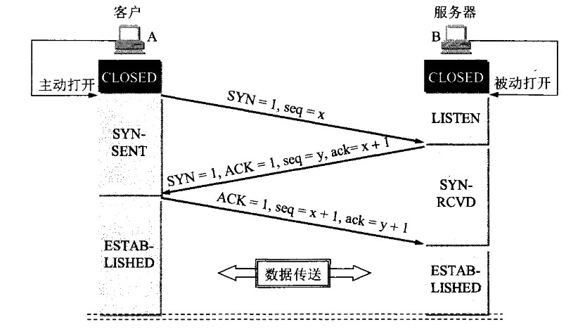
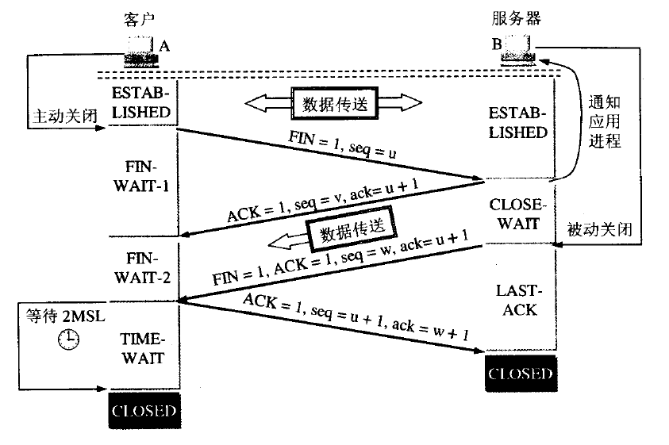
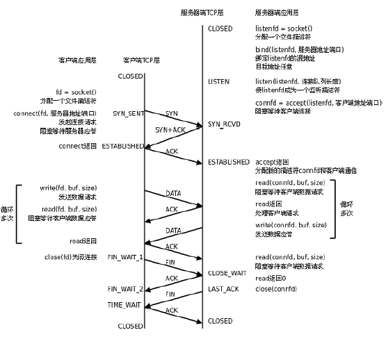

## 计算机网络基础
（参考自顶向下的计算机网络/图解http/http权威指南）

---
---
### 网络基础
#### 计算机网络中的常见概念

1. 何为计算机网络协议？

协议，即规则的集合。计算机的网络协议指的是为了网络中的数据交换而建立的规则与标准；特点是控制对等实体之间的通信，是水平的。低层的协议对高层是透明的。

2. 何为接口？

接口指的是相邻两层之间信息交换的连接点。

3. 何为服务？

服务指的是下层为相邻上层提供的功能调用，是垂直的关系。

#### 面向连接和无连接服务的区别？

* 面向连接服务中，通信的双方必须先建立连接，分配相应的资源，用以保证通信可以顺利进行，传输结束后再回收相关资源。是一种可靠的服务。

* 无连接服务中，通信前双方不需要先建立连接，需要发送数据时直接发送，把带有目的地址的数据包直接传送到线路上，由系统选定路线进行传输，只会尽最大努力交付，是一种不可靠的服务。

#### 可靠服务和不可靠服务的区别？

* 可靠服务指的是网络中有纠错、检错、应答等机制，可以保证数据正确可靠地传送到目的地；

* 不可靠服务指网络尽量正确的传送，但是不能保证数据可以正确可靠地到达目的地。

#### OSI传输协议以及对应每一层的功能与传输单位？

1. 物理层

功能是在物理硬件上为设备端透明地传输原始比特流，传输单位是比特；

2. 数据链路层

功能是将网络层的IP数据包组装成数据帧，传输单位是帧；

3. 网络层

功能是将网络分组从源端传送到目的端，为分组进行路由的选择。传输单位是IP数据报；

4. 传输层

功能是负责主机两个进程间的通信，传输单位是报文段（TCP）或者用户数据报（UDP）；

5. 会话层

负责处理不同主机上各进程之间的会话。

6. 表示层

处理两个通讯系统之间交换信息的表示方式。（数据压缩、加密和解密等）

7. 应用层

为应用提供访问OSI的手段

#### TCP/IP 协议

1. 网络接口层 或者叫 链路层（OSI 下两层）

2. 网际层 或者叫 网络层

3. 传输层

4. 应用层（OSI 上三层）

---
---

### 应用层协议
### HTTP

#### HTTP协议的工作流程（我打开一个网页都发生了哪些过程）？

1. 浏览器分析用户请求的URL地址
2. 浏览器向DNS服务器请求URL所对应的域名服务器IP地址
3. DNS解析出IP地址
4. 浏览器和对应服务器建立TCP连接
5. 浏览器发出get请求
6. 服务器通过HTTP响应将相应的文件（Html、其他资源等）发送给浏览器
7. TCP连接释放
8. 浏览器解析收到的文件，将web页面显示给用户

#### HTTP协议的特点？

HTTP是无状态的，同一个客户对同一个服务器发送相同的HTTP请求，服务器的响应是完全相同的。这样简化了服务器的设计，提高了服务器支持的并发请求数目。

HTTP基于TCP协议，保证数据的可靠传输。但是本身是无连接的，也就是说在双方交换报文前不需要事先建立连接。1.1以后默认使用流水线的持久连接。所有引用对象共计一个RTT时延。

#### HTTP首部通常包含哪些内容？

##### 1. 通用首部字段：

请求报文和响应报文两方都会使用的首部。

Cache-Control：控制缓存

Connection：控制不再转发给代理的首部字段（标记的字段会被删除）；管理持久连接

Date：首部字段Date 表明创建HTTP 报文的日期和时间

Transfer-Encoding：规定了传输报文主体时采用的编码方式

Upgrade: 用于检测HTTP 协议及其他协议是否可使用更高的版本进行通信，其参数值可以用来指定一个完全不同的通信协议。

Via: Via 是为了追踪客户端与服务器之间的请求和响应报文的传输路径。报文经过代理或网关时，会先在首部字段Via 中附加该服务器的信息，然后再进行转发

Warning: 告知用户一些与缓存相关的问题的警告

...

##### 2. 请求首部字段：

从客户端向服务器端发送请求报文时使用的首部。补充了请求的附加内容、客户端信息、响应内容相关优先级等信息。

Accept: 用户代理能够处理的媒体类型及媒体类型的相对优先级

Accept-Charset

Accept-Encoding

Accept-Language

Authorization: 告知服务器用户代理的认证信息

Expect: 告知服务器期望出现的某种特定行为

From: 用来告知服务器使用用户代理的用户的电子邮件地址

Host: 会告知服务器请求的资源所处的互联网主机名和端口号

If-xxx: 这种样式的请求首部字段，都可称为条件请求。服务器接收到附带条件的请求后，只有判断指定条件为真时，才会执行请求

If-Match

If-Modified-Since

If-None-Match

If-Range

If-Unmodified-Since

Referer: 会告知服务器请求的原始资源的URI

User-Agent: 会将创建请求的浏览器和用户代理名称等信息传达给服务器

##### 3. 响应首部字段：

从服务器端向客户端返回响应报文时使用的首部。补充了响应的附加内容，也会要求客户端附加额外的内容信息。

Accept-Ranges: 是用来告知客户端服务器是否能处理范围请求，以指定获取服务器端某个部分的资源

Age 能告知客户端，源服务器在多久前创建了响应。字段值的单位为秒

ETag: 能告知客户端实体标识。它是一种可将资源以字符串形式做唯一性标识的方式。服务器会为每份资源分配对应的ETag 值

Location: 可以将响应接收方引导至某个与请求URI位置不同的资源

Proxy-Authenticate: 会把由代理服务器所要求的认证信息发送给客户端

Retry-After: 告知客户端应该在多久之后再次发送请求

Server: 告知客户端当前服务器上安装的HTTP 服务器应用程序的信息

...

##### 4. 实体首部字段：

针对请求报文和响应报文的实体部分使用的首部。补充了资源内容更新时间等与实体有关的信息。

Allow 用于通知客户端能够支持Request-URI 指定资源的所有HTTP 方法,get？head?

Content-Encoding 会告知客户端服务器对实体的主体部分选用的内容编码方式

Content-Language 会告知客户端，实体主体使用的自然语言

Content-Length 表明了实体主体部分的大小

Content-Location 给出与报文主体部分相对应的URI

Expires 会将资源失效的日期告知客户端

Last-Modified 指明资源最终修改的时间

...

另外还有为cookie使用的首部字段：Set-Cookie和Cookie

#### HTTP缓存机制？

可参考https://www.jianshu.com/p/9a561b36e9f3

Cookie是一个存储在用户主机中的文本文件，里面包含一串识别码，用于服务器识别用户，根据识别码就可以查询到用户的浏览记录，可以据此执行一些个性化推荐。

而session 是存储在服务器端的S类似于HashTable结构（每一种web开发技术的实现可能不一样，下文直接称之为HashTable）来存放用户数据;它的作用是实现网页之间数据传递，是一个存储在服务器端的对象集合。

二者的区别：

1，session 在服务器端，cookie 在客户端（浏览器）

2，session 默认被存在在服务器的一个文件里（不是内存）

3，session 的运行依赖 session id，而 session id 是存在 cookie 中的，也就是说，如果浏览器禁用了 cookie ，同时 session 也会失效（但是可以通过其它方式实现，比如在 url 中传递 session_id）

4，session 可以放在文件、数据库、或内存中都可以。

5，用户验证这种场合一般会用 session。

#### session的管理

基于表单认证的标准规范尚未有定论，一般会使用Cookie 来管理
Session（会话）。
基于表单认证本身是通过服务器端的Web 应用，将客户端发送过
来的用户ID 和密码与之前登录过的信息做匹配来进行认证的。
但鉴于HTTP 是无状态协议，之前已认证成功的用户状态无法通过
协议层面保存下来。即，无法实现状态管理，因此即使当该用户下一次
继续访问，也无法区分他与其他的用户。于是我们会使用Cookie 来管
理Session，以弥补HTTP 协议中不存在的状态管理功能。

    步骤1： 客户端把用户ID 和密码等登录信息放入报文的实体部分，
    通常是以POST 方法把请求发送给服务器。而这时，会使
    用HTTPS 通信来进行HTML 表单画面的显示和用户输入
    数据的发送。
    
    步骤2： 服务器会发放用以识别用户的Session ID。通过验证从客
    户端发送过来的登录信息进行身份认证，然后把用户的认
    证状态与Session ID 绑定后记录在服务器端。
    向客户端返回响应时，会在首部字段Set-Cookie 内写入
    Session ID（如PHPSESSID=028a8c…）。
    你可以把Session ID 想象成一种用以区分不同用户的等位号。
    然而，如果Session ID 被第三方盗走，对方就可以伪装成你的
    身份进行恶意操作了。因此必须防止Session ID 被盗，或被
    猜出。为了做到这点，Session ID 应使用难以推测的字符串，
    且服务器端也需要进行有效期的管理，保证其安全性。
    另外，为减轻跨站脚本攻击（XSS）造成的损失，建议事
    先在Cookie 内加上httponly 属性。
    
    步骤3： 客户端接收到从服务器端发来的Session ID 后，会将其作
    为Cookie 保存在本地。下次向服务器发送请求时，浏览器
    会自动发送Cookie，所以Session ID 也随之发送到服务器。
    服务器端可通过验证接收到的Session ID 识别用户和其认
    证状态。

除了以上介绍的应用实例，还有应用其他不同方法的案例。
另外，不仅基于表单认证的登录信息及认证过程都无标准化的方
法，服务器端应如何保存用户提交的密码等登录信息等也没有标准化。
通常，一种安全的保存方法是，先利用给密码加盐（salt）A 的方式
增加额外信息，再使用散列（hash）函数计算出散列值后保存。但是我
们也经常看到直接保存明文密码的做法，而这样的做法具有导致密码泄
露的风险。

salt其实就是由服务器随机生成的一个字符串，但是要保证长度足够长，并
且是真正随机生成的。然后把它和密码字符串相连接（前后都可以）生成散
列值。当两个用户使用了同一个密码时，由于随机生成的salt值不同，对应
的散列值也将是不同的。这样一来，很大程度上减少了密码特征，攻击者也
就很难利用自己手中的密码特征库进行破解。

#### HTTP常见的响应状态码有哪些？分别什么含义？

参考https://www.cnblogs.com/xflonga/p/9368993.html

##### 1xx 信息性状态码

100 continue

2XX 成功

#####  2XX: 成功

200 OK
 
204 No Content 

206 Partial Content 

##### 3XX 重定向 

301 Moved Permanently 

302 Found  

303 See Other 

304 Not Modified  

307 Temporary Redirect 

##### 4XX 客户端错误 

400 Bad Request 

401 Unauthorized 

403 Forbidden 

404 Not Found 

##### 5XX 服务器错误  

500 Internal Server Error  

503 Service Unavailable 

#### HTTP和HTTPS的关系？

HTTP缺点：

●通信使用明文（不加密），内容可能会被窃听

●不验证通信方的身份，因此有可能遭遇伪装

●无法证明报文的完整性，所以有可能已遭篡改

用SSL 建立安全通信线路之后，就可以在这条线路上进行HTTP通信了,与SSL 组合使用的HTTP 被称为HTTPS.

HTTPS 不是新协议。只是HTTP 通信接口部分用
SSL（Secure Socket Layer）和TLS（Transport Layer Security）协议代替
而已。通常，HTTP 直接和TCP 通信。当使用SSL 时， 则演变成先和
SSL 通信，再由SSL 和TCP 通信了。

加密和解密同用一个密钥的方式称为共享密钥加密（Common key
crypto system），也被叫做对称密钥加密。

而SSL 采用一种叫做公开密钥加密（Public-key cryptography）的加密处理方式。又称为非对称加密技术。
使用公开密钥加密方式，发送密文的一方使用对方的公开密钥进行
加密处理，对方收到被加密的信息后，再使用自己的私有密钥进行解
密。利用这种方式，不需要发送用来解密的私有密钥，也不必担心密钥
被攻击者窃听而盗走。

参考https://www.jianshu.com/p/64fc37e06648

HTTPS 采用共享密钥加密和公开密钥加密两者并用的混合加密机
制。若密钥能够实现安全交换，那么有可能会考虑仅使用公开密钥加密
来通信。但是公开密钥加密与共享密钥加密相比，其处理速度要慢。
所以应充分利用两者各自的优势，将多种方法组合起来用于通信。
在交换密钥环节使用公开密钥加密方式，之后的建立通信交换报文阶段
则使用共享密钥加密方式。

SSL 不仅提供加密处理，而且还使用了一种被称为证书的手段，可用于确定
证书由值得信任的第三方机构颁发，用以证明服务器和客户端是实
际存在的。另外，伪造证书从技术角度来说是异常困难的一件事。所以
只要能够确认通信方（服务器或客户端）持有的证书，即可判断通信方
的真实意图。代价是价格高。

#### DNS协议是什么？

全称 Domain Name System， 是用于将人记忆的主机名（网址主页URL）转换为机器处理的IP地址的协议。

采用 C/S 模型，协议基于UDP， 一般使用53号端口。

#### 域名解析过程是什么样的？

客户端需要解析域名时，通过DNS客户端构造一个DNS请求报文，以UDP数据报发往本地的域名服务器。

域名解析可以分为递归查询 与 递归、迭代结合查询，但是由于递归查询会造成顶层服务器负载过重，因此一般不使用。

过程为;

1. 客户机向本地域名服务器发出DNS请求报文；
2. 本地域名服务器收到请求后，先查询本地缓存，如果没有再自己以DNS客户的身份向根域名服务器发送请求；
3. 根域名服务器收到请求，判断属于什么哪个顶级域，将对应的顶级服务器IP返还给本地域名服务器。
4. 本地域名服务器接着向顶级域名服务器发送查询请求，顶级域名服务器收到请求后，判断属于哪个授权域，将对应的授权域名服务器IP返还给本地域名服务器
5. 本地域名服务器向授权域名服务器发送查询请求
6. 授权域名服务器返还查询结果
7. 本地域名服务器将结果缓存到本地，然后同时将结果返回给客户机。

#### 关于域名

互联网层次树状结构的方式给服务器和路由器命名，任何一个连接到互联网的主机或者路由器都有一个唯一的层次结构名，称为域名。

域名可以被进一步划分为子域名，他们之间通过 . 分隔，处于最右边的为顶级域名，从右往左依次为二级、三级。

例如 www.baidu.com 中 com 为顶级域名，baidu为二级域名，www为三级域名。

整个域名系统实质是一个联机的分布式数据库系统。域名到IP地址的解析都是通过运行在域名服务器上的程序完成的。

#### 

---
---
### 传输层协议
### TCP

#### TCP三次握手和四次挥手？

三次握手：

  

四次挥手：

  

完整周期：

  

#### 为什么TIME_WAIT状态还需要等2MSL后才能返回到CLOSED状态？

TIME_WAIT状态有两个存在的理由。

（1）为了可靠地实现TCP全双工链接的终止。

这是因为虽然双方都同意关闭连接了，而且握手的4个报文也都协调和发送完毕，按理可以直接回到CLOSED状态（就好比从SYN_SEND状态到ESTABLISH状态那样）；但是因为我们必须要假想网络是不可靠的，你无法保证你最后发送的ACK报文会一定被对方收到，因此对方处于LAST_ACK状态下的SOCKET可能会因为超时未收到ACK报文，而重发FIN报文，所以这个TIME_WAIT状态的作用就是用来重发可能丢失的ACK报文。

（2）为了允许老的重复的报文在网络中完全消逝。

假设在12.106.32.254的1500端口和206.168.1.112.219的21端口之间有一个TCP连接。我们关闭这个链接，过一段时间后在相同的IP地址和端口建立另一个连接。后一个链接成为前一个的化身。因为它们的IP地址和端口号都相同。TCP必须防止来自某一个连接的老的重复分组在连接已经终止后再现，从而被误解成属于同一链接的某一个某一个新的化身。为做到这一点，TCP将不给处于TIME_WAIT状态的链接发起新的化身。既然 TIME_WAIT状态的持续时间是MSL的2倍，这就足以让某个方向上的分组最多存活msl秒即被丢弃，另一个方向上的应答最多存活msl秒也被丢弃。 通过实施这个规则，我们就能保证每成功建立一个TCP连接时。来自该链接先前化身的重复分组都已经在网络中消逝了。

为什么上图中的A在TIME-WAIT状态必须等待2MSL时间呢？ 

第一，为了保证A发送的最后一个ACK报文能够到达B。这个ACK报文段有可能丢失，因而使处在LAST-ACK状态的B收不到对已发送的FIN+ACK报文段的确认。B会超时重传这个FIN+ACK报文段，而A就能在2MSL时间内收到这个重传的FIN+ACK报文段。如果A在TIME-WAIT状态不等待一段时间，而是在发送完ACK报文段后就立即释放连接，就无法收到B重传的FIN+ACK报文段，因而也不会再发送一次确认报文段。这样，B就无法按照正常的步骤进入CLOSED状态。 

第二，A在发送完ACK报文段后，再经过2MSL时间，就可以使本连接持续的时间所产生的所有报文段都从网络中消失。这样就可以使下一个新的连接中不会出现这种旧的连接请求的报文段。

#### 基于P2P的迅雷为什么要基于UDP，而不是TCP？

1）开销
2）穿透
3）速度

#### UDP和TCP可不可以共用一个网络端口？

---

### 网络层协议

#### ARP协议是干嘛的，工作在哪一层？

#### IP地址的分类？

#### IP地址有哪些常见的扩展方法？

#### IPv6?

#### RIP 和 OSPF 协议都是干嘛的？

---

### 链路层

#### 链路层的流量控制机制实现？

#### 
